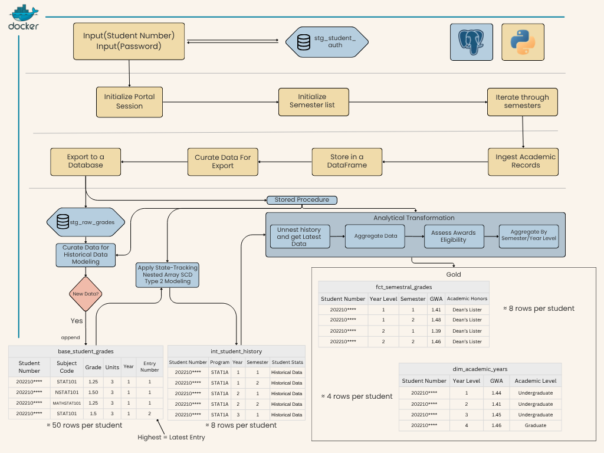

# Student Vault: Institutional Data Infrastructure & ETL Pipeline

---

> ### Security & Sanitization Note
> <small>This repository is a **technical showcase** of an end-to-end Data Engineering pipeline. For security and privacy, the following measures have been applied:</small>
>
> * <small>**Abstracted Endpoints:** All URLs and API selectors use generic placeholders.</small>
> * <small>**Standardized Schema:** Database objects use industry-standard naming conventions (`stg_`, `fct_`, `dim_`) to demonstrate **Medallion Architecture**.</small>
> * <small>**Zero-Secret Policy:** No real-world credentials or API keys are included; configuration is handled via `.env` (not tracked).</small>
> * <small>**Data Privacy:** Logic includes PII protection and `bcrypt` password hashing.</small>
>
> <small>**Purpose:** This project is intended for **architectural audit** and logic review. It demonstrates proficiency in **Python (FastAPI)**, **SQL (Procedures)**, and **Dimensional Modeling**.</small>

---

## Executive Summary
Developed **Student Vault**, an end-to-end data engineering solution that automates the extraction and transformation of legacy student portal data. By implementing a **three-tier Medallion-style architecture** and **State-tracking Nested Array SCD Type 2 modeling**, I achieved a **125x data compression ratio**, transforming 250,000+ raw records into a streamlined 2,000-row analytical layer. This foundation allowed for functional modules to be developed atop the gold layer, automating manual efforts such as GWA calculations and awards eligibility verifications.

---

## Architecture Diagram

* **Orchestration:** Containerized via Docker.
* **Logic:** Python-driven extraction with PostgreSQL stored procedures for transformation.
* **Data Modeling:** Implementation of **State-tracking Nested Array SCD Type 2 Modeling** in the int_student_history table to track academic progression.

---

## The Problem: Underleveraged Data Assets
The University Student Portal contained years of academic records, yet it remained an underleveraged resource. Because data was trapped and underleveraged, high-value administrative tasks—like the weeks-long manual verification of President's and Dean's List honors—required hundreds of man-hours of manual GWA calculation. The university had the data, but lacked the **analytical infrastructure** to use it.

---

## Technical Solution

### 1. Prototype UI & ETL Data Pipeline
* **UI Prototype:** Developed a custom front-end (**Student Vault**) to showcase potential UX improvements and analytical functionalities.
* **Extraction:** Built a Python-based ingestion engine to scrape the existing University Portal’s Grade Endpoint, handling complex session authentication and HTML parsing to migrate data from the legacy system into the Vault ecosystem.
* **Transformation & Load:** Developed a sql-based transformation stored procedure that handles the majority of the transformations (Nested CTEs, complex joins, and state-tracking nested array SCD Type 2 Modeling) and stores the data into a 3-Layer Data Lakehouse

### 2. The 3-Layer Analytical Warehouse
To ensure efficiency and scalability, I implemented a Medallion-style architecture:

| Layer | Contains | Description |
| :--- | :--- | :--- |
| **Bronze** | **Raw Data** | Preserved granular grade data (Initial pilot: ≈250k rows for 500 students) for full auditability. |
| **Silver** | **Nested Historical Data** | Implemented State-tracking Nested Array SCD Type 2 Modeling. This "Operational Truth" handles grade adjustments without losing historical context. |
| **Gold** | **Semestral Data** | Programmatically aggregated individual grades from the silver layer into semestral GWAs. This serves as the **Single Source of Truth** for immediate actions, such as honors assessment. |
| **Gold** | **Yearly Data** | Compressed Data even further by year level, providing a 125x data compression ratio for reporting and more aggregations such as academic status.|

### 3. Proof of Concept: Automated Honors Assessor
Automated the aggregations inside the **Gold Layer** that instantly identify Dean’s and President’s List candidates, a task that previously required manual cross-referencing of hundreds of physical and digital records.

---

## Architecture Evolution: From Efficiency to Integrity
The Student Vault evolved through two distinct architectural phases to balance the needs of portal stability with institutional data requirements.

### Phase 1: Inverted Tier (Efficiency Optimization)
Initial development prioritized University's legacy portal's footprint Reduction. To minimize the footprint on the University’s legacy portal, the system used an "Inverted Ingestion" model. This bypassed redundant layers to deliver rapid UX responses but lacked long-term state tracking. Diagram can been seen here: [Inverted_Architecture_Diagram](Inverted_Diagram.png)

### Phase 2: Medallion Architecture (Institutional Standard)
For the Pilot Program, the architecture was re-engineered into a traditional Three-Tier Medallion Pipeline. This transition was critical to support Auditability and SCD Type 2 Modeling, ensuring that every grade adjustment is tracked as a historical event.

---

## Compliance & Ethics
Navigated the portal’s "no-scraping" Terms of Service by pitching the project as a **systemic solution** rather than a simple script. This professional transparency successfully secured formal approval from the **College Dean** to move toward full institutional integration.

---

## The Result
The project successfully transitioned from a personal technical challenge to an institutional pilot program. By demonstrating the scalability of the 3-layer architecture, the project is currently undergoing full integration, with the potential to automate workflows for over **42,000 students**.
